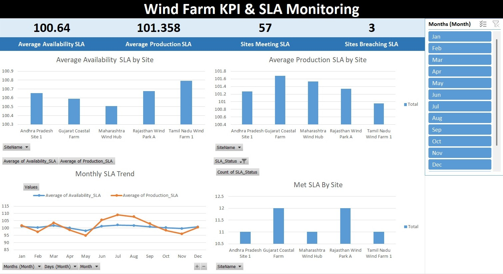

# Wind Farm KPI & Contractual SLA Monitoring System
 
A small end-to-end data pipeline that tracks wind farm performance against contractual Service Level Agreements (SLAs), built on **Microsoft Access** (relational backend) and **Excel** (KPI dashboard).
 
## Why this project
 
In wind energy O&M and power purchase agreements, operators commit to a minimum **turbine availability %** and/or **production volume (MWh)** for each site. Falling short of those targets can trigger liquidated damages or contract penalties. Tracking this across multiple sites and months by hand in disconnected spreadsheets doesn't scale and is easy to get wrong.
 
This project models that workflow properly: a normalized database stores the contract terms and the monthly operational data, SQL queries calculate SLA compliance automatically, and a dashboard surfaces the result so breaches can't be missed.
 
## Architecture
 
```
Turbine_Sites.csv  ─┐
                     ├─► Database.accdb (Access)  ─►  qry_SLA_Performance  ─►  WindFarm_SLA_Dashboard.xlsx
Monthly_Performance.csv ─┘                          └─► qry_SLA_Breach
```
 
- **Access (.accdb)** — relational backend with two normalized tables and two saved queries that compute SLA ratios and isolate breach months.
- **Excel (.xlsx)** — presentation layer: KPI cards, pivot tables, and charts built from the query output.
- **CSV exports** — portable copies of the raw tables for anyone without Access, or for loading into Python/Power BI.
## Data model
 
**Turbine_Sites** (5 sites)
`SiteID, SiteName, State, CustomerName, InstalledCapacity_MW, ContractedAvailability_pct, ContractedProduction_MWh, ContractStartYear`
 
Five operating wind farms across Tamil Nadu, Rajasthan, Gujarat, Andhra Pradesh, and Maharashtra, ranging from 45 MW to 80 MW installed capacity, each with its own contracted availability and production target.
 
**Monthly_Performance** (60 records — 5 sites × 12 months of 2025)
`RecordID, SiteID, SiteName, Month, ActualProduction_MWh, TheoreticalProduction_MWh, ActualAvailability_pct, GridHours, DowntimeHours, TotalHours`
 
## SLA logic
 
`qry_SLA_Performance` joins the two tables and calculates, per site per month:
 
- **Availability_SLA %** = `ActualAvailability_pct / ContractedAvailability_pct × 100`
- **Production_SLA %** = `ActualProduction_MWh / ContractedProduction_MWh × 100`
- **SLA_Status** = `Breach` once Production_SLA drops below ~95%, otherwise `Met SLA`
`qry_SLA_Breach` filters that result down to the breach rows only, which feeds the dashboard's alert table.
 
## Dashboard


 
`WindFarm_SLA_Dashboard.xlsx` has four sheets:
 
- **Dashboard** — KPI cards (average Availability SLA, average Production SLA, months met vs. breached) plus four charts: Availability SLA by Site, Average Production SLA by Site, Monthly SLA Trend, and Met SLA by Site.
- **Pivot Table** — site-level and month-level breakdowns of both SLA metrics, plus SLA status counts per site.
- **SLA Table** — the full 60-row computed dataset.
- **Breach Table** — the months that fell below the production SLA threshold.
## Key finding
 
Across the full year, every site held its **availability** SLA every single month — the turbines themselves were reliable. The breaches all happened on the **production** side, concentrated in May 2025 across three sites, when actual output fell short of the contracted volume despite turbines being available. It's a good illustration of why availability and production need to be tracked as separate SLA metrics: a turbine can be technically "available" and still miss its production target if the wind resource itself underperforms.
 
## Repo contents
 
| File | Description |
|---|---|
| `Database.accdb` | Access backend — tables + SLA queries |
| `Turbine_Sites.csv` | Site/contract reference data |
| `Monthly_Performance.csv` | Monthly operational data |
| `WindFarm_SLA_Dashboard.xlsx` | KPI dashboard, pivots, and breach alerts |
 
## How to explore it
 
1. Open `Database.accdb` in Microsoft Access to inspect the tables and the `qry_SLA_Performance` / `qry_SLA_Breach` queries, or tweak the breach threshold.
2. Open `WindFarm_SLA_Dashboard.xlsx` to view the dashboard, pivot tables, and breach alerts.
3. Use the CSVs to load the same data into Python, Power BI, or any other tool without needing Access installed.
## Possible extensions
 
- Parameterize the SLA breach threshold instead of hardcoding it
- Add a liquidated-damages calculation based on breach severity
- Connect Power BI / Power Query directly to the Access backend for a live-refreshing dashboard
- Extend the dataset to multiple years for year-over-year SLA trend analysis
---
 
*This is a portfolio project built on synthetic data to demonstrate database design, SQL-based KPI calculation, and dashboard reporting for contract performance monitoring — a common requirement in renewable energy asset management.*